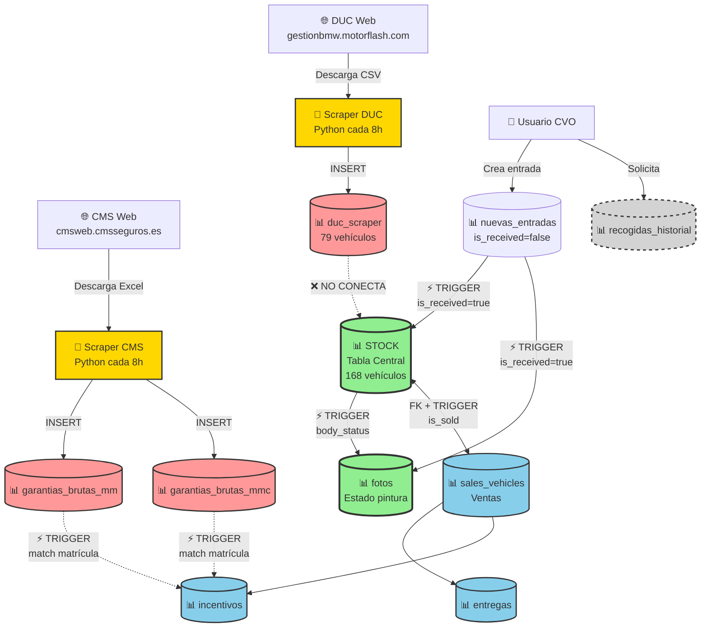
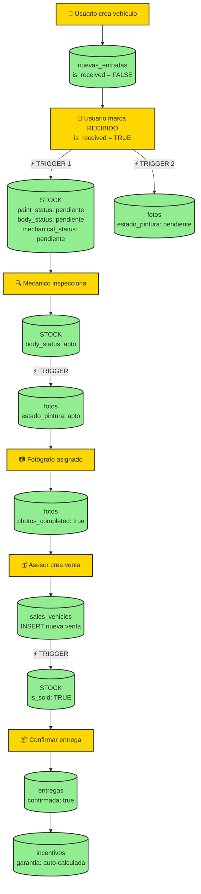
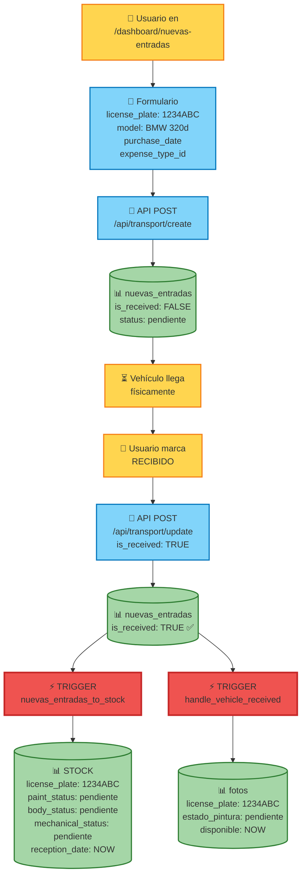
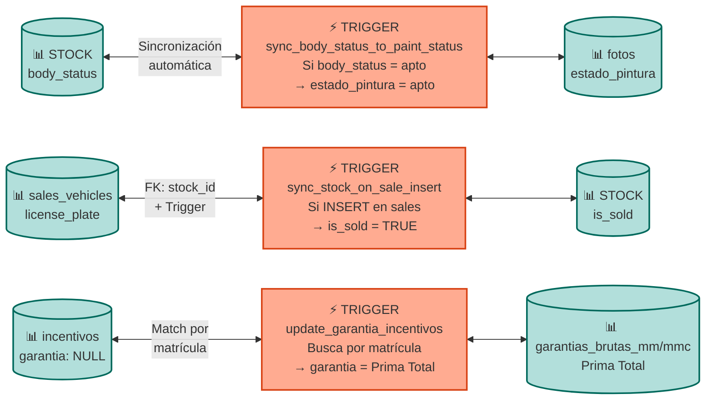
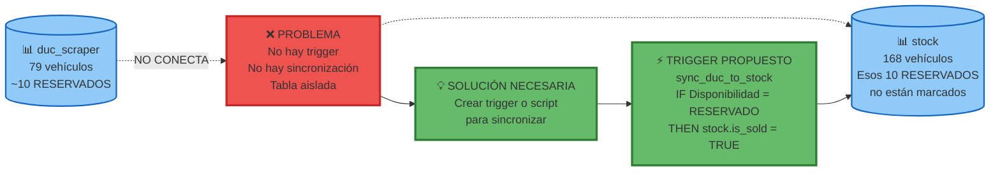
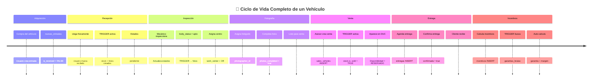

# 🗺️ MAPA DE FLUJO COMPLETO - SISTEMA CVO
**Diagramas visuales del flujo de datos entre tablas**

---

## 📊 DIAGRAMA 1: VISTA GENERAL DEL SISTEMA



---

## 📊 DIAGRAMA 2: CASCADA VERTICAL - FLUJO PRINCIPAL



---

## 📊 DIAGRAMA 3: PASO 1 - SCRAPER DUC (AISLADO)

```mermaid
flowchart LR
    %% INICIO
    DUC[🌐 DUC Web<br/>gestionbmw.motorflash.com<br/>79 vehículos publicados]
    
    %% SCRAPER
    SCRAPER[🤖 Scraper Python<br/>main.py<br/>Cada 8 horas]
    
    %% CSV
    CSV[📄 CSV Descargado<br/>stock_551_0_*.csv<br/>dist/data/duc/]
    
    %% PROCESO
    PANDAS[🐼 pandas.read_csv<br/>Limpieza de datos<br/>Mapeo de columnas]
    
    %% BASE DE DATOS
    DELETE[🗑️ DELETE ALL<br/>duc_scraper]
    INSERT[➕ INSERT nuevos<br/>79 registros]
    
    %% TABLA
    DUC_SCRAPER[(📊 duc_scraper<br/>79 vehículos<br/>~68 DISPONIBLE<br/>~10 RESERVADO<br/>~1 VENDIDO)]
    
    %% PROBLEMA
    STOCK[(📊 stock<br/>168 vehículos)]
    NOCONEXION[❌ NO HAY CONEXIÓN<br/>❌ NO HAY TRIGGER<br/>❌ TABLA AISLADA]
    
    %% FLUJO
    DUC -->|Selenium<br/>Login + Download| SCRAPER
    SCRAPER --> CSV
    CSV --> PANDAS
    PANDAS --> DELETE
    DELETE --> INSERT
    INSERT --> DUC_SCRAPER
    DUC_SCRAPER -.->|NO ALIMENTA| NOCONEXION
    NOCONEXION -.-> STOCK
    
    %% ESTILOS
    classDef external fill:#e1f5ff,stroke:#01579b,stroke-width:2px
    classDef process fill:#fff3e0,stroke:#e65100,stroke-width:2px
    classDef tabla fill:#c8e6c9,stroke:#2e7d32,stroke-width:2px
    classDef problema fill:#ffcdd2,stroke:#c62828,stroke-width:3px
    
    class DUC external
    class SCRAPER,PANDAS,DELETE,INSERT process
    class CSV,DUC_SCRAPER,STOCK tabla
    class NOCONEXION problema
```



---

## 📊 DIAGRAMA 4: PASO 2 - NUEVAS ENTRADAS → STOCK + FOTOS



---

## 📊 DIAGRAMA 5: RELACIONES HORIZONTALES (MISMO NIVEL)



---

## 📊 DIAGRAMA 6: TRIGGERS DEL SISTEMA

```mermaid
flowchart TD
    %% TÍTULO
    TITLE[🔥 TODOS LOS TRIGGERS ACTIVOS]
    
    %% TRIGGER 1
    T1[⚡ nuevas_entradas_to_stock<br/>WHEN: is_received = TRUE<br/>ACTION: INSERT INTO stock]
    
    %% TRIGGER 2
    T2[⚡ handle_vehicle_received<br/>WHEN: is_received = TRUE<br/>ACTION: INSERT INTO fotos]
    
    %% TRIGGER 3
    T3[⚡ sync_body_status_to_paint_status<br/>WHEN: body_status = apto<br/>ACTION: UPDATE fotos.estado_pintura]
    
    %% TRIGGER 4
    T4[⚡ sync_stock_on_sale_insert<br/>WHEN: INSERT en sales_vehicles<br/>ACTION: UPDATE stock.is_sold = TRUE]
    
    %% TRIGGER 5
    T5[⚡ sync_stock_on_sale_delete<br/>WHEN: DELETE en sales_vehicles<br/>ACTION: UPDATE stock.is_sold = FALSE]
    
    %% TRIGGER 6
    T6[⚡ sync_stock_on_sale_update<br/>WHEN: UPDATE license_plate en sales<br/>ACTION: UPDATE ambos stocks]
    
    %% TRIGGER 7
    T7[⚡ update_garantia_incentivos<br/>WHEN: INSERT en garantias_brutas<br/>ACTION: UPDATE incentivos.garantia]
    
    %% TRIGGER 8
    T8[⚡ update_garantia_incentivos<br/>WHEN: INSERT en incentivos<br/>ACTION: Buscar garantía + UPDATE]
    
    %% FLUJO
    TITLE --> T1
    TITLE --> T2
    TITLE --> T3
    TITLE --> T4
    TITLE --> T5
    TITLE --> T6
    TITLE --> T7
    TITLE --> T8
    
    %% TABLAS AFECTADAS
    T1 --> STOCK1[(stock)]
    T2 --> FOTOS1[(fotos)]
    T3 --> FOTOS2[(fotos)]
    T4 --> STOCK2[(stock)]
    T5 --> STOCK3[(stock)]
    T6 --> STOCK4[(stock)]
    T7 --> INC1[(incentivos)]
    T8 --> INC2[(incentivos)]
    
    %% ESTILOS
    classDef trigger fill:#ff7043,stroke:#bf360c,stroke-width:2px
    classDef tabla fill:#90caf9,stroke:#1565c0,stroke-width:2px
    
    class T1,T2,T3,T4,T5,T6,T7,T8 trigger
    class STOCK1,STOCK2,STOCK3,STOCK4,FOTOS1,FOTOS2,INC1,INC2 tabla
```



---

## 📊 DIAGRAMA 7: PROBLEMA - duc_scraper AISLADO



---

## 📊 DIAGRAMA 8: FLUJO COMPLETO DE UN VEHÍCULO



---

## 🎯 LEYENDA DE DIAGRAMAS

### Símbolos Usados:

```
🌐 = Web externa (DUC, CMS)
🤖 = Scraper automatizado
👤 = Usuario del sistema
📊 = Tabla en Supabase
⚡ = Trigger automático
🔌 = API Route
📝 = Formulario
🔍 = Proceso de inspección
📷 = Fotografía
💰 = Venta
📦 = Entrega
❌ = Problema/No conexión
💡 = Solución propuesta
✅ = Confirmado/Correcto
```

### Tipos de Líneas:

```
───>  = Flujo directo (INSERT, UPDATE)
-..-> = No hay conexión (problema)
<---> = Sincronización bidireccional
═══>  = Trigger automático
```

### Colores:

```
🟡 Amarillo = Acción manual del usuario
🔵 Azul     = Tabla de base de datos
🔴 Rojo     = Trigger automático
🟢 Verde    = Tabla central (stock, fotos)
⚪ Gris     = Tabla aislada (duc_scraper)
🟠 Naranja  = Proceso/Scraper
```

---

## 📱 CÓMO VISUALIZAR ESTOS DIAGRAMAS

### Opción 1: GitHub
- Sube este archivo a GitHub
- GitHub renderiza Mermaid automáticamente

### Opción 2: Visual Studio Code
- Instala extensión: "Markdown Preview Mermaid Support"
- Abre este archivo
- Preview (Ctrl+Shift+V)

### Opción 3: Online
- https://mermaid.live/
- Copia el código del diagrama
- Visualiza en tiempo real

### Opción 4: Obsidian
- Abre este archivo en Obsidian
- Obsidian soporta Mermaid nativamente

---

**Creado:** 21 de octubre de 2025  
**Tipo:** Mapas visuales del flujo de datos  
**Diagramas:** 8 diagramas Mermaid interactivos


