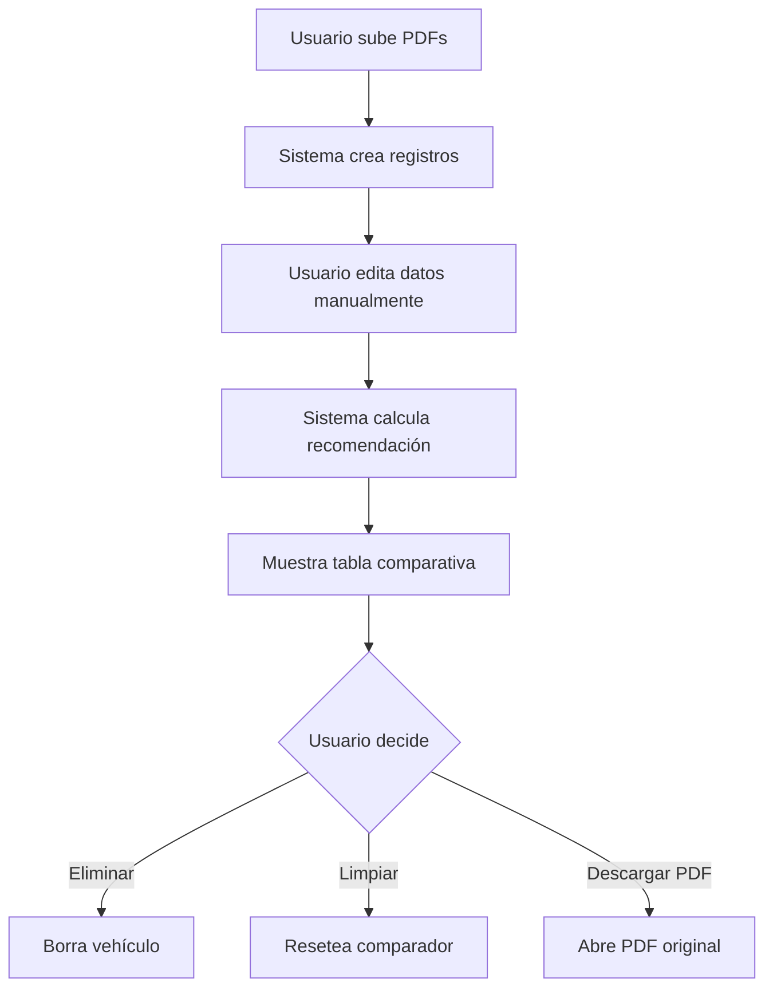

# 🔄 Comparador de Vehículos

## 📋 Descripción

Sistema inteligente para comparar múltiples vehículos mediante la carga de PDFs con sus configuraciones completas. Incluye análisis automático y recomendación basada en múltiples criterios.

---

## 🎯 Características Principales

### 1. Carga de PDFs
- **Múltiples archivos simultáneos**: Sube varios PDFs a la vez
- **Nombre del archivo = VIN**: El nombre del PDF debe ser el bastidor corto (VIN)
- **Formato**: Solo archivos PDF
- **Almacenamiento**: Vercel Blob Storage

### 2. Datos del Vehículo

#### Datos Opcionales (manuales)
- **Kilometraje**: Ingresar manualmente
- **Fecha 1ª Matriculación**: Selector de fecha
- **Precio**: En euros (€)
- **Marca, Modelo, Versión**: Identificación del vehículo
- **Color y Tapicería**: Mostrados en encabezado de columnas
- **Equipación**: Lista de opcionales (separados por comas)

### 3. Tabla Comparativa

#### Estructura
- **Encabezado por columna**: VIN + Color + Tapicería
- **Filas**: Características/equipación
- **Indicadores**: ✓ (tiene) / ✗ (no tiene)

### 4. Sistema de Recomendación Automático

Evalúa cada vehículo según:
- **Equipación** (peso x2): Más opcionales = mejor puntuación
- **Kilometraje**: Menos KM = mejor puntuación
- **Precio**: Menor precio = mejor puntuación  
- **Año**: Más reciente = mejor puntuación

**Omite criterios sin datos**: Si no hay precio/km/año, no los considera en la comparación.

---

## 📁 Estructura de Archivos

```
app/
├── api/
│   └── comparador/
│       ├── upload/route.ts      # Subir PDFs
│       ├── update/route.ts      # Actualizar datos
│       ├── delete/route.ts      # Eliminar vehículo
│       └── clear/route.ts       # Limpiar comparador
├── dashboard/
│   └── comparador/
│       └── page.tsx             # Página principal
components/
└── comparador/
    └── comparador-table.tsx     # Componente tabla
sql/
└── create_comparador_vehiculos.sql  # Tabla DB
types/
└── comparador.ts                # Tipos TypeScript
```

---

## 🗄️ Base de Datos

### Tabla: `comparador_vehiculos`

```sql
CREATE TABLE comparador_vehiculos (
  id uuid PRIMARY KEY,
  user_id uuid REFERENCES auth.users(id),
  vin text NOT NULL,
  pdf_url text NOT NULL,
  pdf_filename text NOT NULL,
  
  -- Datos del vehículo
  marca text,
  modelo text,
  version text,
  color text,
  tapiceria text,
  equipacion jsonb DEFAULT '[]'::jsonb,
  
  -- Datos opcionales
  kilometros integer,
  fecha_matriculacion date,
  precio numeric(10, 2),
  
  -- Metadatos
  created_at timestamptz DEFAULT now(),
  updated_at timestamptz DEFAULT now()
);
```

#### Políticas RLS
- Usuarios solo ven **sus propios** vehículos comparados
- CRUD completo con validación de `user_id`

---

## 🔧 API Routes

### 1. **POST** `/api/comparador/upload`
Sube múltiples PDFs

**Request:**
```typescript
FormData con archivos: File[]
```

**Response:**
```json
{
  "results": [
    {
      "filename": "ABC123XY.pdf",
      "success": true,
      "data": { /* VehiculoComparador */ }
    }
  ]
}
```

---

### 2. **POST** `/api/comparador/update`
Actualiza datos de un vehículo

**Request:**
```json
{
  "id": "uuid",
  "kilometros": 50000,
  "fecha_matriculacion": "2021-06-15",
  "precio": 35000,
  "marca": "BMW",
  "modelo": "X3",
  "color": "Negro",
  "tapiceria": "Cuero Beige",
  "equipacion": ["Techo panorámico", "Navegador", "Cámara 360º"]
}
```

---

### 3. **POST** `/api/comparador/delete`
Elimina un vehículo del comparador

**Request:**
```json
{
  "id": "uuid"
}
```

---

### 4. **POST** `/api/comparador/clear`
Elimina todos los vehículos del usuario del comparador

**Request:**
```json
{}
```

---

## 🎨 Interfaz de Usuario

### Vista Principal

1. **Botones de acción**
   - Subir PDFs (múltiples)
   - Limpiar Todo

2. **Card de Recomendación** (si hay vehículos)
   - Icono ⚡ Sparkles
   - VIN recomendado + badge
   - Descripción breve

3. **Tabla de Datos**
   - Edición inline (clic en "Editar")
   - Campos: VIN, Marca, Modelo, Color, Tapicería, KM, Fecha, Precio
   - Botones: Ver PDF, Editar, Eliminar

4. **Tabla Comparativa**
   - Columnas por vehículo
   - Encabezado: VIN + Color + Tapicería + icono recomendado
   - Filas: Equipación con ✓/✗

---

## 📝 Uso Paso a Paso

### 1. Preparar PDFs
- Renombrar archivos con el VIN del vehículo
- Ejemplo: `ABC123XY.pdf`, `DEF456ZW.pdf`

### 2. Subir PDFs
- Clic en **"Subir PDFs"**
- Seleccionar múltiples archivos
- Esperar confirmación de carga

### 3. Completar Datos
- Clic en **"Editar"** en cada vehículo
- Rellenar: Marca, Modelo, Color, Tapicería
- Agregar KM, Fecha matriculación, Precio (opcionales)
- Agregar equipación separada por comas:
  ```
  Techo panorámico, Navegador, Cámara 360º, Asientos calefactados
  ```
- Clic en ✓ para guardar

### 4. Ver Comparativa
- Revisar tabla comparativa automática
- Observar **icono ⚡** en vehículo recomendado
- Descargar PDFs si es necesario

### 5. Limpiar
- Eliminar vehículos individuales con 🗑️
- O usar **"Limpiar Todo"** para resetear

---

## 🧮 Algoritmo de Recomendación

```typescript
puntuacion = 0

// Equipación (peso x2)
puntuacion += vehiculo.equipacion.length * 2

// Kilometraje (si disponible)
if (kilometros) {
  puntuacion += max(0, 10 - (kilometros / 10000))
}

// Precio (si disponible)
if (precio) {
  puntuacion += max(0, 10 - (precio / 5000))
}

// Antigüedad (si disponible)
if (fecha_matriculacion) {
  años = año_actual - año_matriculacion
  puntuacion += max(0, 10 - años)
}

// El vehículo con mayor puntuación es recomendado
```

---

## 🔒 Seguridad

- **RLS habilitado**: Solo usuario propietario ve sus comparadores
- **Autenticación requerida**: Todas las API routes validan sesión
- **Aislamiento de datos**: `user_id` verificado en cada operación
- **Validación de archivos**: Solo PDFs permitidos

---

## ✅ Parser Automático de PDFs

El sistema **extrae automáticamente** los siguientes datos de PDFs BMW/MINI:

- **VIN completo** (17 caracteres)
- **Marca** (MINI/BMW)
- **Modelo** y versión completa
- **Color** del vehículo
- **Tapicería** 
- **Lista completa de equipación** (~40-50 opcionales)

### Formato Soportado
PDFs de **Warranty Extranet BMW/MINI** con estructura estándar.

### Tecnología
- Librería: `pdfjs-dist`
- Parser: `lib/pdf-parser.ts`
- Extracción: Regex patterns optimizados

---

## 🎯 Mejoras Futuras

- [x] ~~Extracción automática de datos del PDF~~ ✅ IMPLEMENTADO
- [ ] Exportar comparativa a PDF/Excel
- [ ] Compartir comparativa con otros usuarios
- [ ] Guardar comparativas históricas
- [ ] Integración con datos de stock real
- [ ] Gráficos visuales de comparación
- [ ] Filtros avanzados de equipación

---

## 📊 Ejemplo de Flujo



---

**Versión:** 1.0.0  
**Fecha:** 28/10/2025  
**Autor:** Sistema CVO Dashboard

